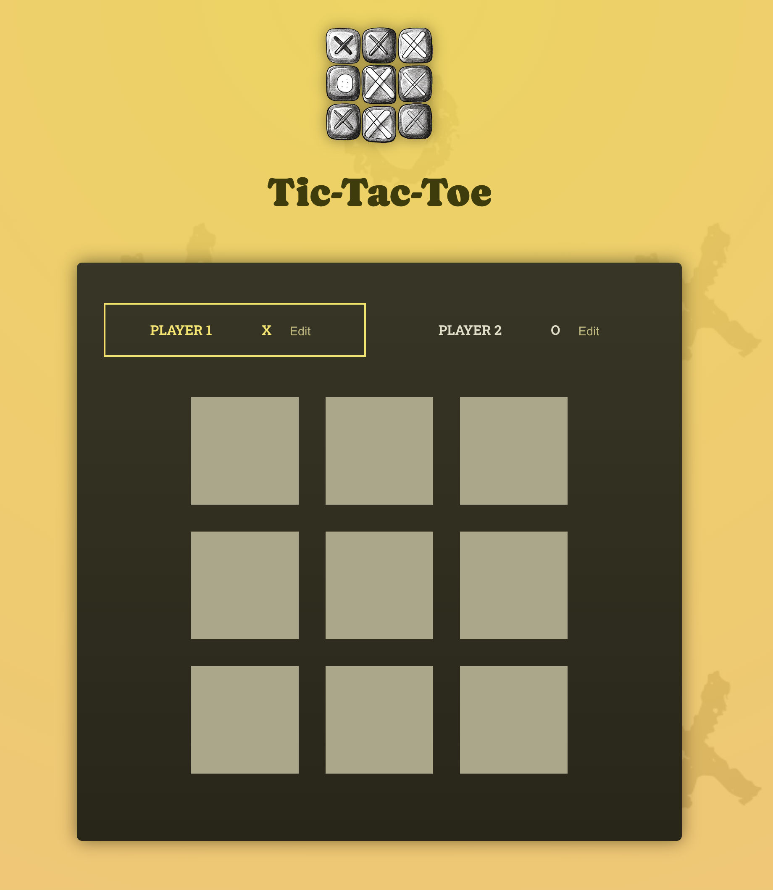
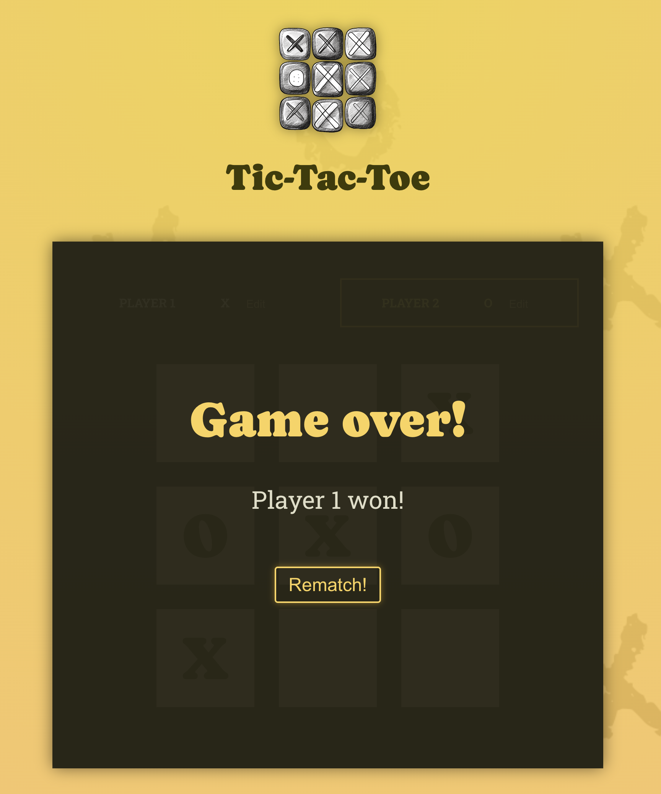

# Tic-Tac-Toe Project Using React.js

I developed this project as part of my journey into frontend development with React.js. The application was built exclusively with React components, without the use of any additional frameworks or libraries.
Thanks to the wonderful instructor Maximilian Schwarzmüller, I was able to complete this project as part of my journey in this [course](https://www.udemy.com/course/react-the-complete-guide-incl-redux/).

## To Boot Up the Project

1. Clone the project to your local machine: `git clone git@github.com:polaeskandar/project-tic-tac-toe.git`.
2. Change to the project directory: `cd project-tic-tac-toe`.
3. Install the necessary node packages: `npm install`.
4. Run the application: `npm run dev`.

## Feedback & Contact

If you have any feedback you would like to give regarding this project, please feel free to open a new issue in the issues tab. Alternatively, you can reach me through the following:

- LinkedIn: [@polaeskandar](https://www.linkedin.com/in/polaeskandar/)
- Business Email: pola.eskandar@codingstreamer.com
